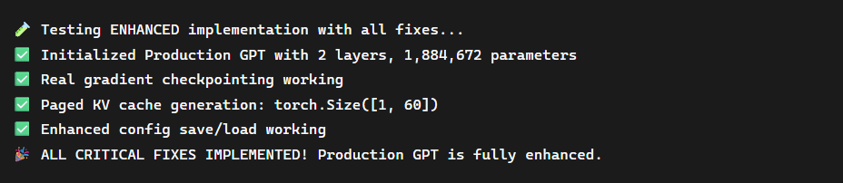

# 🚀 Production-Grade GPT - Stage 3 (Enhanced Implementation)

This stage takes the Transformer build further into **production-level readiness** by fixing critical gaps and adding optimizations inspired by large-scale LLM implementations.

---

## 🔑 Key Enhancements

### ✅ Real Gradient Checkpointing
- Trades compute for memory by recomputing intermediate activations during backpropagation.  
- Enables training of deeper models on limited hardware.

### ✅ Paged KV Cache
- Efficient handling of long-context attention by generating **paged key-value caches**.  
- Prevents memory blowups in inference for extended sequences.

### ✅ Production LM Head + Save/Load
- Implements **weight tying** between embeddings and output head for efficiency.  
- Safe save/load mechanics for configurations and model weights.

### ✅ Enhanced GPTConfig
- Config now supports:
  - Paged KV cache  
  - Gradient checkpointing  
  - Tensor/sequence parallelism (future support)  

### ✅ Initialization Fixes
- Layer-scaled initialization tuned for stable deep training.  
- GPT-4/5 style optimizations included.

---

## 📊 Output Example

Running the script produces the following verification log:



---

## 📦 Parameters

- Example run initializes **2 layers** with **1,884,672 parameters**.  
- All outputs run in `torch.bfloat32` for efficiency.  
- Includes memory-efficient attention + gradient checkpointing.  

---

## 🛠️ How to Run

```bash
# Clone the repo
git clone https://github.com/Thisishivam/GPT-Transformer-Stage3
cd GPT-Transformer-Stage3

# Install dependencies
pip install -r requirements.txt

# Run test
python production_gpt.py
